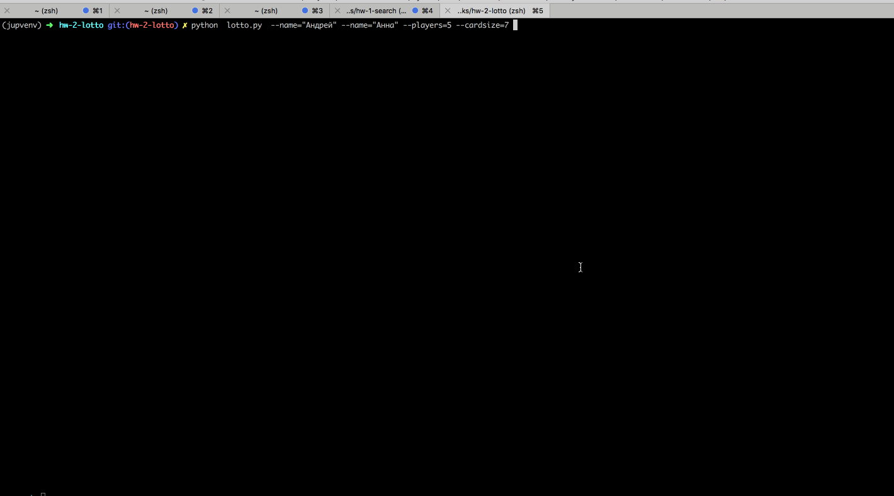

# Домашнее задание №2 по курсу OTUS WebPython 2020

## Задача

Написать игру "Лото"

Минимальные требования: 2 игрока - человек играет с компьютером
 - (Дополнительно *) возможность выбирать тип обоих игроков (компьютер или человек) таки образом чтобы можно было играть: компьютер - человек, человек - человек, компьютер - компьютер
 - (Дополнительно *) возможность играть для любого количества игроков от 2 и более
 - Создать Dockerfile для запуска проекта с помощью docker

## Обзор реализованного функционала

### Модификация изначальной формулировки

Я решал задачу со следующими модификациями:

 - Одна карта состоит из только одного ряда чисел, а не трех  (это связано с типом консольного 
 отображения карты, который я реализовал - трехрядная карта заняла бы слишком много места 
 на экране)
 - При попытке закрыть позицию неправильно каким-либо игроком, игра не прекращается - вместо
 этого игрок просто удаляется из игры, и она продолжается без него.
 
### Функционал и особенности реализации
 
Функционал игры состоит из двух частей
 
  - DSL для консольной печати, реализующий простую блочную модель документа для консоли
    - Находится в пакете `console`
    - Реализует следующие примитивы для консольного вывода (краткая документация есть в коде):
        - `RectangularBuildingBlock`
        - `Row`, `Column`, `PaddableRow`, `PaddableColumn` 
        - `VerticalSeparator`, `HorizontalSeparator`
        - `VerticalPadding`, `HorizontalPadding`
        - `Digit`, `TextLine`, `Text`
    - Производит компиляцию из высокоуровневых примитивов в строки консольного вывода
    - Использует ООП, наследование, абстрактные классы
  - Собственно игра лото
    - Построена на системе классов для объектов игры:
        - `Lotto`: класс, реализующий логику и отображение в консоли всей игры
        - `User`: класс, реализующий логику и отображение отдельного игрока (человек или компьютер)
        - `Dealer`: класс, реализующий логику ведущего игры
        - `Card`:  класс, реализующий логику и отображение карты игрока
        - `CardNumber`, `UsedCardNumber`: классы, реализующие отображение отдельного числа (позиции) - 
        открытой или закрытой
        - `Messages`: класс, реализующий отображение сообщений о ходе игры
    - Все классы наследуются от `RectangularBuildingBlock`, что  решает проблему 
    их отображения в консоли.
    - Действия игрока реализуются "по принципу Redux" - они генерируют actions, которые
    затем отрабатываются игрой

## Игровой процесс

### Как проходит игра

Процесс игры состоит из игровых итераций, которые продолжаются до тех пор, пока один или несколько 
игроков не выиграют, либо (если играют только люди) пока все игроки не будут удалены из игры за
попытку жульничества - в этом случае победителей нет.

Одна игровая итерация предлагает игроку-человеку следующие действия
 - Запросить следующий бочонок у ведущего
 - Закрыть позицию на своей карте
    - Для этого нужно ввести аббревиатуру своего имени  и номер позиции через пробел
    - Сообщение подсказывает какая аббревиатура (английская буква A, B, C) кому назначена
    - При попытке закрыть несуществующую позицию на карте, игрок удалятся из игры
    - При игре нескольких человек, каждый желающий может в свою очередь закрыть позицию на своей карте
 - Вывести на экран номер последнего объявленного боченка
 - Прекратить игру
 
 Игроки, за которых играет компьютер, всегда закрывают свои позиции своевременно, и никогда 
 не жульничают
 
 В случае если один или несколько игроков (людей или нет) полностью закрыли свои карты после
 объявления очередного боченка, игра тем не менее не прекращается сразу, если у одного или
 нескольких игроков - людей есть возможность полностью закрыть свои карты тем же боченком -
 в такой ситуации они могут это сделать и разделить победу с остальными выигравшими. 
 
 Соответствующее сообщение одной игровой итерации выглядит примерно так:
 
     Сделайте выбор:
        n - Объявить следующий бочонок
        p - Напомнить последний объявленный бочонок
        <имя игрока> <позиция>, где <имя игрока> (аббревиатура на английском: A, B, etc.) :
            A - Андрей
            B - Анна,
        a позиция - позиция бочонка на карте, целое число: 1, 2, 3, 4, etc, напр.: А 2
        q - Завершить игру
    >>>
    
 Пример игрового процесса:
 
 
 
## Установка и запуск
 
Выкачиваем репозиторий, устанавливаем venv, зависимости

    cd testdir
    git clone https://github.com/possibly-harmless/WebPythonOTUS.git
    cd WebPythonOTUS/homeworks/hw-2-lotto
    python -m venv venv
    deactivate
    cd venv/bin
    source activate
    cd ../..
    pip install -r requirements.txt
    
Простейшая проверка

    python  lotto.py  --name="Игрок"
    
### 3.2 Все доступные опции и help    
    
После выполнения следующей строчки 

    python lotto.py --help
    
Должно вернуться что-то вроде этого:  

    Usage: lotto.py [OPTIONS]
    
    Options:
      --name TEXT         Имя игрока-человека. Повторяйте для каждого игрока в
                          случае нескольких
    
      --players INTEGER   Общее число игроков. Не должно превышать максимального
                          числа игроков 7
    
      --cardsize INTEGER  Число позиций в карточке. Не должно превышать 10
      --maxnum INTEGER    Максимальное число на боченке. Не должно превышать 90
      --help              Show this message and exit.     

### 3.3 Примеры использования

Играет 2 человека и 3 компьютерных игрока:

    python lotto.py  --name="Андрей" --name="Анна" --players=5 --cardsize=7

Играют несколько человек, все игроки - люди:

    python lotto.py --name="Leo" --name="Kate" --name="Андрей" --name="Оля" --name="Сергей" --players=5
    
Играют 3 компьютерных игрока, без людей:

    python lotto.py --players=3

